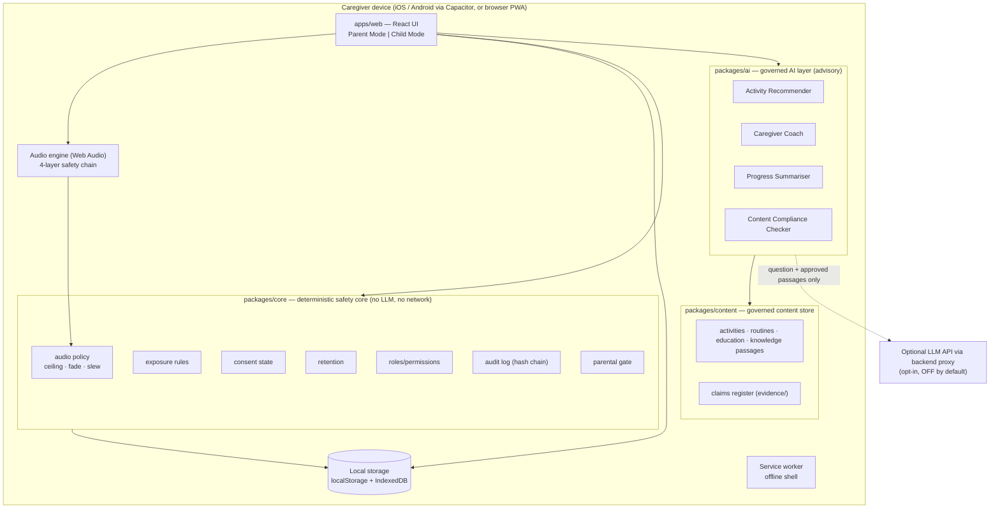

# System Architecture

Owner: Agent Architects · Status: Gate 1 approved (pre-approved, ADR-0001)

## 1. Overview

## 2. Components

| Component | Responsibility | Key REQs | Integrity level |
| --- | --- | --- | --- |
| `packages/core/audio` | Gain math, ceilings, fade and slew schedules, stop timing | REQ-SAF-01, 03, 04, 07 | **Highest**: 100% branch coverage |
| `packages/core/exposure` | Graded-exposure state machine | REQ-M5-05, REQ-SAF-05, REQ-SAF-06 | **Highest** |
| `packages/core/consent` | Consent state, versioning, and whether data may be stored | REQ-PRV-01, REQ-PRV-05 | High: 100% branches |
| `packages/core/retention` | Purging by age; delete-all | REQ-PRV-04 | High |
| `packages/core/rbac` | Permission matrix | REQ-PRV-06 | High |
| `packages/core/audit` | Append-only hash-chained log with a PII field blocklist | REQ-PRV-07 | High |
| `packages/core/gate` | Parental gate challenge and lockout | REQ-SAF-08 | High |
| `packages/content` | Typed content and schema validation; tier, source, reviewer, version | REQ-NFR-05, M1–M9 | Content is governed through the compliance checker |
| `packages/ai` | Four bounded agents (see `agent_contracts.md`) | REQ-AI-01…08 | Advisory; the core never depends on it |
| `apps/web` | UI, audio engine, storage repository, i18n, service worker | M1–M8, REQ-NFR-* | — |

**Dependency rule:** `core` imports nothing from other packages. `content` imports `core` types only. `ai` imports `content`. `apps/web` imports all three. Safety functions never import `ai` (enforced by a unit test that scans the imports).

## 3. Data flow: a guided session
1. The caregiver opens Today. The Recommender scores library activities against the goals, logs and preferences (all local), and returns 2–4 activity IDs with reasons.
2. The caregiver starts the session. The player shows cue cards. Model audio plays only on a tap, through the engine, capped at the mode ceiling.
3. At the end, the 30-second participation log is written through the repository, which checks `consent.canStore()` first. An audit event (`session.logged`, no PII) is appended.

## 4. Offline-first and sync design
- **MVP:** everything is local. The service worker precaches the app shell and all content, so the app runs fully offline (REQ-NFR-03, REQ-SAF-09). Only the opt-in LLM coach needs the network; it falls back to offline extractive mode.
- **Post-MVP sync (design only):** an end-to-end encrypted, per-family document store. Each record carries `{id, updatedAt, deviceId, version}`; conflicts resolve last-writer-wins per field, and deletions are kept as tombstones. Sync starts only after verifiable parental consent (OQ-03). Therapists see only what the caregiver has shared (a grant stored in the RBAC context). The therapist portal (REQ-M9-02) uses the same API with MFA.

## 5. Deployment
- The PWA is served as static files; there is no server in the MVP.
- Capacitor shells for iOS and Android are built from the same `dist/`. A native plugin (later) provides the audio route and system volume (R-16) and guided-access prompts.
- The LLM proxy (later) is a stateless function holding the API key. It forwards only the question and passage IDs and text, and logs no content.
