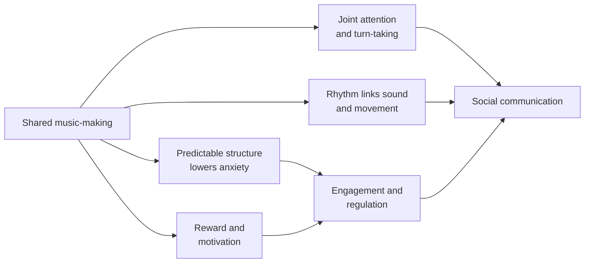

# Music and Sound Therapy for Children with Autism: A Sub-Study

Sep 23, 2026 · @Someone

## Abstract

Music therapy delivered by a credentialed therapist is a low-risk intervention with moderate-quality evidence of short-term benefit for overall functioning and quality of life in autistic children, with smaller and less certain effects on specific social and communication skills, though it does not reliably reduce core autism severity. Commercial "sound therapies" that claim to retrain hearing, such as Auditory Integration Training, have weak or no supporting evidence.

This sub-study, a companion to Autism Spectrum Disorder: A Comprehensive Review of Causes, Symptoms, Effects, and Management, reviews why music appeals to many autistic children, the main types of music and sound interventions, the clinical evidence up to 2025, proposed mechanisms, management of sound sensitivity, and practical guidance for parents. Evidence is graded throughout as verified, emerging, or unverified.

## 1. Background: why music matters for autistic children

Many autistic children respond to music more readily than to speech, and music processing is often a relative strength in autism. Several observations support its use:

- **Preserved or enhanced musical perception.** Autistic children often match or exceed peers in pitch discrimination and pitch memory; absolute ("perfect") pitch is more common in autism than in the general population.
- **Emotion in music is understood.** Autistic children can usually identify happy, sad or scary music as accurately as peers, even when they struggle to read emotion in faces.
- **Predictable structure.** Songs have repetition, rhythm and a clear beginning and end. This predictability suits a brain that finds unpredictable social exchange hard.
- **A non-verbal route to interaction.** Turn-taking, imitation, shared attention and anticipation can happen through drums or songs without needing words.
- **Motivation.** Music is intrinsically rewarding for many children, making it an effective context for practising skills.

At the same time, **sound can be distressing.** A large share of autistic children are over-sensitive to certain noises (hyperacusis or misophonia-like reactions). Music and sound interventions therefore span two goals: using music to build skills, and helping children cope with difficult sound environments.

## 2. Types of music and sound interventions

"Music therapy" is a regulated clinical profession in many countries (e.g. MT-BC in the US, HCPC registration in the UK). Many other music activities and commercial sound programmes are not music therapy, and the evidence differs sharply between them.

| Intervention | Delivered by | How it works | Evidence tier |
| --- | --- | --- | --- |
| **Improvisational music therapy** | Credentialed music therapist | Therapist follows and musically responds to the child's sounds, movements and play, building joint attention and turn-taking | Emerging–moderate |
| **Structured / educational music therapy** | Music therapist | Songs and musical games target specific goals (greetings, naming, waiting, following instructions) | Emerging–moderate |
| **Family-centred music therapy** | Music therapist coaching parents | Parents learn musical play for daily routines at home | Emerging (e.g. Sharda et al., 2018) |
| **Neurologic Music Therapy (NMT)** — e.g. Rhythmic Auditory Stimulation, Therapeutic Singing | Certified NMT therapist | Rhythm and melody used to organise movement, speech and attention | Limited in autism; stronger evidence in stroke and Parkinson's |
| **Melodic Intonation / Auditory-Motor Mapping Training (AMMT)** | Therapist | Singing words while tapping drums to link sound and speech-motor planning, aimed at minimally verbal children | Small promising studies |
| **Music in speech-language or special education sessions** | Speech therapists, teachers | Songs used to teach vocabulary, routines and transitions | Widely used; low-quality evidence but low risk |
| **Recreational music** (lessons, choirs, adapted bands) | Music teachers, community groups | Skill-building, enjoyment, social belonging | Good for wellbeing; not a treatment |
| **Auditory Integration Training (Berard), Tomatis, Samonas** | Commercial practitioners | Filtered or modulated music via headphones to "retrain" hearing | Weak or none (see Section 5) |
| **Safe and Sound Protocol (SSP)** | Licensed providers | Filtered music based on polyvagal theory to calm the nervous system | Unverified; no controlled trials in autism |
| **Sound sensitivity strategies** | Parents, OTs, audiologists | Ear defenders, noise-cancelling headphones, gradual exposure, quiet spaces | Practical, supported by clinical consensus |

A typical music therapy course runs 30–45 minute sessions once or twice a week for 8–20 weeks, with clearly written goals shared with the family.

## 3. Evidence review

The weight of evidence says music therapy probably helps autistic children's overall functioning in the short term, but the largest rigorous trial found no effect on core autism severity. Results depend heavily on how outcomes are measured.

| Study | Design and size | Main finding | Take-away |
| --- | --- | --- | --- |
| [Gao et al., *Frontiers in Psychiatry*, 2025](https://pmc.ncbi.nlm.nih.gov/articles/PMC11783185/) | Meta-analysis, 13 RCTs, 1,160 children aged 1–14 | Medium effect on behavioural symptoms (SMD −0.66); high heterogeneity; most trials from China | Encouraging but uneven study quality |
| Geretsegger et al., *Cochrane Review*, 2022 | 26 trials, 1,165 participants | Music therapy probably increases the chance of global improvement (moderate certainty); may improve overall autism severity and quality of life; little clear change in specific social and communication measures; no increase in adverse effects | The most authoritative summary: modest, real, low-risk benefit |
| Bieleninik et al. (TIME-A), *JAMA*, 2017 | RCT, 364 children aged 4–7, 9 countries, 5 months | No significant difference in ADOS social affect scores vs enhanced standard care | Improvisational therapy alone does not reduce core severity |
| Sharda et al., *Translational Psychiatry*, 2018 | RCT, 51 children aged 6–12, 8–12 weeks | Better parent-rated communication and family quality of life; stronger auditory–motor brain connectivity on MRI | First evidence of brain-level change alongside functional gains |
| Thompson et al., *Journal of Music Therapy*, 2014 | RCT, 23 preschoolers, family-centred sessions | Improved social interaction at home and in the community; better parent–child relationship | Supports parent-involved models |
| Wan et al. (AMMT), *PLoS ONE*, 2011 | Proof-of-concept, 6 minimally verbal children | Gains in imitating words and phrases after 40 sessions | Promising for minimally verbal children; needs larger trials |

### 3.1 Interpreting the evidence

- **Where benefits show up:** parent- and therapist-rated global functioning, engagement, family quality of life, and in-session social behaviour.
- **Where they do not:** standardised clinician-observed measures of core autism features (e.g. ADOS), especially in longer multi-country trials.
- **Limitations:** small samples, short follow-up, difficulty blinding parents and therapists, varied therapy styles, and uneven trial quality.
- **Safety:** no significant adverse effects reported in controlled trials, provided sound levels respect the child's sensitivities.

**Overall tier: Emerging–moderate.** Music therapy is a reasonable, enjoyable add-on to core support such as speech therapy and developmental intervention, not a replacement for them.

## 4. Proposed mechanisms

Music likely helps by giving children a predictable, motivating, non-verbal channel for the same skills that core interventions target. The main proposed pathways are:

Each arrow is a hypothesis with partial support, not a proven pathway.

- **Auditory–motor coupling.** Rhythm engages motor and auditory brain networks together. Sharda et al. (2018) found stronger auditory–motor connectivity after music therapy, which may support speech-motor planning and coordination.
- **Shared neural networks for music and language.** Singing activates bilateral networks, including right-hemisphere regions that may be more accessible than left-lateralised speech areas in some minimally verbal children. This is the rationale for AMMT and melodic intonation.
- **Predictability and regulation.** Repetition and clear structure reduce uncertainty, lowering arousal and opening a window for learning.
- **Social synchrony.** Moving and playing in time with another person is linked to bonding and cooperation, and it lets children experience social turn-taking without the demands of conversation.
- **Reward.** Music activates dopamine-linked reward circuits, increasing motivation to engage and repeat.
- **Emotional expression.** Music offers a way to express and share feelings that may be hard to put into words.

## 5. Sound-based therapies with weak or no evidence

Several commercial programmes claim to "retrain" the ear or nervous system through specially filtered music. None has convincing controlled-trial support in autism. Most are not dangerous, but they cost money and time that could go to proven support.

| Programme | Claim | Evidence | Verdict |
| --- | --- | --- | --- |
| **Auditory Integration Training (AIT, Berard method)** | 20 half-hour sessions of modulated music normalise hearing and reduce autism symptoms | Cochrane review (Sinha et al., 2011) found insufficient evidence; the American Academy of Pediatrics and ASHA do not support it | Unverified |
| **Tomatis method** | Filtered music and mother's voice re-educate listening | A small placebo-controlled trial (Corbett et al., 2008) found no benefit over placebo | Unverified |
| **Samonas, Therapeutic Listening, iLs** | Filtered music programmes improve sensory processing | No robust controlled trials in autism | Unverified |
| **Safe and Sound Protocol (SSP)** | Filtered vocal music calms the nervous system via polyvagal theory | Small studies, mostly by the developer's group; the underlying polyvagal theory is contested | Unverified; low risk under a licensed provider |
| **Binaural beats, "432 Hz" or "Solfeggio" frequency music** | Special frequencies heal or rebalance the brain | No scientific basis for autism | Unverified; harmless as relaxing music if the child enjoys it |
| **Sound baths, singing bowls, "vibrational healing"** | Vibration realigns energy | No evidence | Unverified; may be relaxing for some children, overwhelming for others |

**Practical guidance.** If a family chooses one of these, set a fixed trial period (for example 8 weeks), agree on measurable goals beforehand, and stop if there is no clear change. Watch volume levels: headphone-based programmes should never exceed safe listening levels (about 85 dB, and lower for young children).

## 6. Sound sensitivity (hyperacusis) management

Roughly half or more of autistic children find some everyday sounds distressing or painful — hand dryers, blenders, sirens, crying babies, crowded rooms. The goal is to protect the child from overload while gradually building tolerance and control, not to force exposure.

### 6.1 Assessment

- Arrange a **hearing test by an audiologist** experienced with autistic children, to rule out hearing loss or ear problems.
- Keep a **sound diary** for 1–2 weeks: which sounds, where, how loud, and the child's reaction. Patterns (sudden, high-pitched, unpredictable sounds) guide the plan.
- An **occupational therapist** can assess the wider sensory profile.

### 6.2 Strategies that help

| Strategy | How to use it | Caution |
| --- | --- | --- |
| Ear defenders or noise-cancelling headphones | For planned loud settings: assemblies, shopping centres, fireworks | Continuous all-day use may increase sensitivity over time; use them situationally |
| Warning and predictability | Say "I'm going to use the blender in 3 seconds" and count down; let the child press the button | Unpredictable sounds are usually the worst |
| Control and choice | Let the child control volume and choose music; offer a quiet retreat space | Build in a signal (card or gesture) for "too loud" |
| Graded exposure | Record a difficult sound; play it very softly during a favourite activity, and increase volume in small steps over weeks | Always stay within the child's comfort; stop if distress rises |
| Calming "sound anchors" | Familiar, preferred music or white noise to mask background noise at bedtime or during homework | Keep volume moderate |
| Social stories and visual explanations | Explain what a sound is and why it happens (e.g. the fire alarm) | Pair with practice visits |
| Environmental changes | Soft furnishings, rugs, felt pads on chairs, quieter classroom seating | Coordinate with school |
| CBT-based approaches | For older children whose fear of sounds causes avoidance | Delivered by a trained therapist |

Music therapy can also help here: making loud sounds oneself on a drum, with full control, is often less threatening than hearing them unexpectedly, and can be a gentle bridge to tolerance.

## 7. Practical guide for parents

Parents do not need musical training to use music well at home. Ten to fifteen minutes a day of playful, shared music-making is a realistic and worthwhile goal.

### 7.1 Home music activities by skill goal

| Goal | Activity | Tips |
| --- | --- | --- |
| Joint attention and turn-taking | Drum conversation: you tap a pattern, pause, and wait for your child's reply; copy what they play | Keep pauses long; imitation of the child comes first |
| Anticipation and requesting | "Ready, steady… GO!" songs; pause before the last word and wait for a look, sound or word | The pause is the teaching moment |
| Early words | Familiar songs with the last word left out ("Twinkle twinkle little…") | Accept any attempt, then model the word |
| Following instructions | Action songs ("Head, shoulders, knees and toes"; "If you're happy and you know it") | Slow the tempo; use gestures |
| Transitions and routines | Short, consistent songs for tidy-up, bath time, brushing teeth, leaving the house | The same song every time makes the routine predictable |
| Emotional regulation | Slow, quiet, familiar music during calm-down time; rocking or swaying to the beat | Build a "calm playlist" your child chooses |
| Motor skills | Marching, clapping, shakers, scarves to music | Rhythm supports coordination |
| Social play with siblings or peers | Simple band games: everyone plays, everyone stops when the music stops | Keep groups small and predictable |

### 7.2 Good habits

- **Follow your child's preferences.** Some prefer instrumental music, some a single favourite song on repeat. Start there.
- **Be interactive, not passive.** Screens and background music are not therapy; the benefit comes from making music *together*.
- **Watch sound levels.** Keep volume moderate and avoid sudden loud sounds; let your child control instruments.
- **Use visuals.** Picture cards for song choices help children who are not yet speaking to take part.
- **Celebrate participation, not performance.**

### 7.3 Choosing a music therapist

Ask potential therapists:

1. Are you a credentialed music therapist (e.g. MT-BC, HCPC-registered, or your country's equivalent), and what experience do you have with autistic children?
2. What goals will we set, and how will you measure and report progress?
3. Will you coordinate with my child's speech therapist, OT and school?
4. Can parents join sessions or learn activities to use at home?
5. How long is the initial trial, and when will we review whether to continue?

Be cautious of anyone who promises to cure autism with music, sells expensive listening equipment, or discourages other therapies.

## 8. Conclusions

Music therapy is a safe, enjoyable, strengths-based add-on with moderate evidence for improving overall functioning and family quality of life, but it is not a cure and does not reliably reduce core autism severity on its own.

- **Verified enough to recommend as an add-on:** credentialed music therapy, especially family-centred models with clear goals.
- **Emerging:** singing-based speech approaches (AMMT, melodic intonation) for minimally verbal children; neurologic music therapy techniques.
- **Unverified:** Auditory Integration Training, Tomatis, Safe and Sound Protocol, frequency-based and "healing" sound products.
- **Essential in daily life:** thoughtful management of sound sensitivity, combining protection, predictability and gradual tolerance-building.

Future research should run larger, longer trials with blinded outcome assessors, compare music therapy with other active interventions, include children from diverse and low-resource settings, and measure outcomes autistic people and families value — communication, participation, wellbeing and enjoyment.

## References

**Sources checked for this sub-study (September 2026):**

- Gao et al. [The effectiveness of music therapy in improving behavioral symptoms among children with autism spectrum disorders: a systematic review and meta-analysis](https://pmc.ncbi.nlm.nih.gov/articles/PMC11783185/). *Frontiers in Psychiatry*, 2025.

**Core literature:**

- Bieleninik Ł et al. Effects of improvisational music therapy vs enhanced standard care on symptom severity among children with autism (TIME-A). *JAMA*, 2017.
- Corbett BA et al. Brief report: the effects of Tomatis sound therapy on language in children with autism. *Journal of Autism and Developmental Disorders*, 2008.
- Geretsegger M et al. Music therapy for autistic people. *Cochrane Database of Systematic Reviews*, 2022.
- Heaton P. Assessing musical skills in autistic children who are not savants. *Philosophical Transactions of the Royal Society B*, 2009.
- Sharda M et al. Music improves social communication and auditory–motor connectivity in children with autism. *Translational Psychiatry*, 2018.
- Sinha Y et al. Auditory integration training and other sound therapies for autism spectrum disorders. *Cochrane Database of Systematic Reviews*, 2011.
- Thompson GA, McFerran KS, Gold C. Family-centred music therapy to promote social engagement in young children with severe autism. *Child: Care, Health and Development*, 2014.
- Wan CY et al. Auditory-motor mapping training as an intervention to facilitate speech output in non-verbal children with autism: a proof of concept study. *PLoS ONE*, 2011.

*Literature citations are drawn from the established research record; consult full texts before clinical use.*
